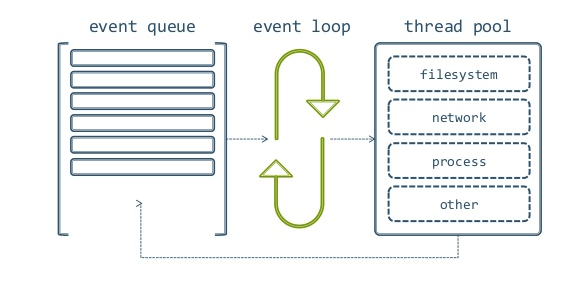
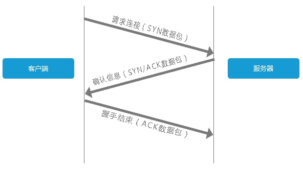
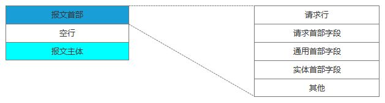
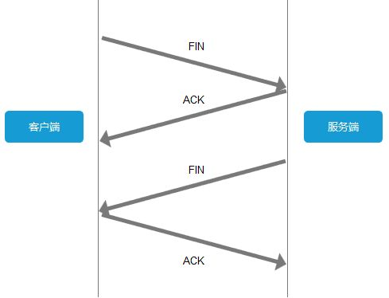

# interview

> 收录了经典前端面试题和解答


### 目录


[TOC]
### 简历

* 基本信息, 姓名-年龄-收集-邮箱-籍贯-博客-github
* 学历
* 工作经历, 时间-公司-岗位-职责-技术栈-业绩
* 开源项目, github和说明
* 兴趣, 和技术相近的兴趣


### 自我介绍

* 把握面试的沟通方向
* 豁达自信适度发挥


### 面试技巧


#### 面试要素

* 知识 
* 能力 
  * 项目把控能力, 业务分析能力, 抽象设计能力
* 经验


#### 面试流程

* 一面 基础知识, html, js, css
* 二面 基础知识延伸, 实现原理, 简历问的比较多
* 三面 一般不问技术, 职业生涯特色业务, 你推动了什么, 你改变了什么
* 终面 潜力, 沟通, 性格


#### 面试准备

* 职位分析
* 业务分析, 实战模拟
* 技术栈准备
* 自我介绍


### 一面

#### 基础知识


##### 页面布局

* **实现一个左右宽度300,高度已知, 中间自适应的布局, 各有什么优点, 缺点, 兼容性**

* **变形题: 实现一个上下高度固定, 中间高度自适应的页面**

  * 浮动, 缺点: 脱离文档流 ,带来混乱. 优点: 兼容性好

  * 绝对定位, 缺点: 脱离文档流 ,带来之后元素混乱. 优点: 兼容性好

  * flex布局 , 优点: 其中某个单元格高度增加, 其他单元格高度也增加. 缺点: 新特性兼容性不好

    ```css
    .container { display: flex; } 
    .center {flex: 1}
    ```

  * table 布局, 优点: 兼容性极好, 其中某个单元格高度增加, 其他单元格高度也增加

    ```css
    .container {display: table;} 
    .left, .right, .center {display: table-cell}
    ```

  * 网格布局, 优点: 先进的

    ```css
    .container {
        display: grid;
        width: 100%;
        grid-template-rows: 100px;
        grid-template-columns: 300px auto 300px;
    }
    ```

  * css计算属性

    ```css
    .left, .right {width: 300px;}
    .center {width: calc(100vw - 600px)}
    ```


##### css盒模型

* 标准盒模型, ie盒模型. 包括margin, border, padding, content

* 两者差别:计算宽度不同, css如何设置box-sizing: border-box/content-box;

* js如何获取和设置不同盒模型的宽高

  ```js
  // 只能获取内联样式的宽高
  el.style.width/height
  // ie获取元素宽高
  el.currentStyle.width/height
  // 通用获取元素的宽和高
  window.getComputedStyle(el).width/height
  
  el.getBoundingClientReact().width/height/left/right
  ```


##### BFC 块级格式化上下文

* **bfc渲染规则**: 
  * 垂直方向不发生重叠 
  *  bfc区域不会与浮动元素重叠 
  * bfc在页面上是一个容器, 之外的元素不会影响内部元素, 内部也不影响外部元素.
* **bfc创建:** 
  * float值不为none,
  * position值不为static或relative 
  * display: table, table-cell 
  * overflow值不为visible
* **bfc使用场景**
  * 消除边距重叠
  * 解决浮动子元素无法撑开父元素高度


* **dom事件**

  * **dom事件的级别**

    * dom0 

      ```js
      el.onclick = function () {}
      ```

    * dom2 

      ```js
      el.addEventListener('click', function () {}, false) // 不使用事件捕获
      ```

    * dom3 , 增加了多种事件类型, 鼠标, 键盘等

      ```js
      el.addEventListener('keyup', function () {}, false)
      ```

  * **dom事件模型**

    * 捕获, 冒泡

  * **dom事件流**

    * 捕获阶段, 处于目标阶段, 冒泡阶段

  * **dom事件捕获的具体流程**

    * window , document, html(document.documentElement), body, target

  * **event对象常见应用**

    * 阻止默认行为 event.preventDefault() 
    * 阻止冒泡 event.stopPropagation()
    * 组织同一元素多个事件绑定其他事件的发生 event.stopImmediatePropagation()
    * event.currentTarget  事件绑定的dom对象
    * event.target 事件触发时的具体元素

  * **自定义事件**

    ```js
    var ev = new Event('custom') // var ev = new CustomEvent('custom', {name: 'a'})
    el.addEventListener('custom', function () {})
    el.dispatchEvent(ev)
    ```


##### http协议

* **http协议的主要特点**

  简单快速, 灵活, 无连接, 无状态

* **http报文的组成成分**
    * 请求报文: 
      - 请求行: http方法, 请求地址,http协议和版本 
      - 请求头 一些key, value值
      - 空行
      - 请求体
  * 响应报文: 
    - 状态行
    - 相应头
    - 空行
    - 响应体
* **http方法**

  * get 获取资源
  * post 传输资源
  * put 更新资源
  * delete 删除资源
  * head 获得报文首部

* **post和get区别**

  * get产生的url地址可被收藏, 而post不可以
  * get请求会被浏览器主动缓存, post不会
  * get只能url编码, 而post支持多种编码
  * get请求的url长度有限(过长截断), 而post没有
  * get比post更不安全, 参数通过url传递, post放在requestbody中

* **http状态码**

  * 1xx: 表示请求已接收, 继续处理

  * 2xx: 成功-请求已成功被接收
    * 200 请求成功
    * 206 部分请求成功(视频, 音频类的流文件)

  * 3xx: 重定向, 要完成请求需进一步操作
    * 301请求的页面已经永久转移到新的url
    * 302 临时转移
    * 304 资源为改动, 请求缓存
  * 4xx: 客户端错误
    * 400 请求的语法错误
    * 401 请求未授权
    * 403: 禁止访问
    * 404 资源不存在

  * 5xx: 服务器错误
    * 500 服务器内部错误
    * 503 服务器宕机或过载

* **什么是持久连接**

  * 1.1版本支持持久连接,非 keep-alive 模式时, 没请求一次都要断开重新连接, 当使用connection: keep-alive时, 可持续连接,必须基于 http1.1 的持久连接, 只有get和head才可以进行管线化

* **什么是管线化**
  * 管线化：请求1 -> 请求2 -> 请求3 -> 响应1 -> 响应 2....
  * 非管线化： 请求1 -> 响应1 -> 请求2 -> 响应2 -


##### 面向对象


* **类的声明, 生成实例**


  * 构造函数方式

    ```js
    function Animal(name) {this.name = name}
    ```

  * class关键字

    ```js
    class Animal {
        constructor (name) {
            this.name = name
        }
    }
    ```

  * 实例化

    ```js
    new Animal()
    ```

* **如何实现继承, 继承的几种方式**


  * **借助构造函数实现继承**

    缺点: 不能继承原型对象上的属性和方法

    ```js
    function Parent1() {
        this.name = 'parent'
    }
    // 不会继承原型链上的属性
    Parent1.prototype.say = function () {
        return this.name
    }
    function Child1() {
        // 关键: 借助构造函数
        Parent1.call(this);
        this.type = 'child'
    }
    new Child1().say() // 没有此方法,报错 error
    ```

  * **借助原型链实现的继承**

    缺点: 共享原型对象属性, 导致不同实例上对原型对象上属性的修改,对互相产生影响

    ```js
    function Parent2() {
        this.name = 'parent'
        this.arr = [1,2,3,4]
    }
    
    function Child2() {
        this.type = 'child'
    }
    // 关键: 借助原型链
    Child2.prototype = new Parent2
    
    var child = new Child()
    var child2 = new Child()
    console.log(child.constructor) // Parent2
    
    child.arr.push(5)
    console.log(child2.arr) // 共享原型属性 [1,2,3,4,5]
    ```

  * **组合式继承**

    缺点: 父类调用两次

    ```js
    function Parent3() {
        this.name = 'parent'
    }
    
    function Child3() {
        Parent3.call(this)
        this.type = 'child'
    }
    
    Child3.prototype = new Parent3()
    
    // 优化1: 组合继承(父类只调用一次), 缺点: constructor无法正确指向
    Child3.prototype = Parent3.prototype
    
    // 优化2: 组合继承(父类只调用一次), constructor也能正确指向
    Child3.prototype = Object.create(Parent3.prototype)
    Child3.prototype.constructor = Child3
    ```

  * **寄生式继承**

    缺点: 子类原型对象无法继承

    ```js
    function Parent4() {
        this.name = 'parent4'
    }
    
    function Child() {
        var obj = new Parent4
        obj.type = 'child'
        return obj
    }
    ```


##### 原型链

* **创建对象的几种方法**

  * **对象字面亮**

    ```js
    var obj = {a: 1}
    var obj2 = new Object({a: 1})
    ```

  * **构造函数**

    ```js
    function Car() {}
    var obj = new Car()
    ```

  * **Object.create**

    ```js
    var proto = {a: 1}
    var instance = Object.create(proto)
    ```

  * **Object.assign**

* **原型, 构造函数, 实例, 原型链**

* **instanceof原理, constructor**

* **new 运算符**

  * 会创建一个object 然后把此object的原型链链接到构造函数的prototype对象上
  * 执行构造函数, 把this绑定到此对象上
  * 如果此函数没有反回对象, 那么new运算符的结果就是此对象


##### 通信

* **什么是同源策略即限制**

  源: 协议, 域名, 端口

  同源策略限制从一个源加载的文档或脚本如何与来自另一个源的资源进行交互.这是一个隔离潜在恶意文件的安全机制.

  具体限制: cookie, localStorage 和 indexDB 无法读取, dom无法获得, ajax无法发送

* **前后端如何通讯**

  * ajax (fetch)

  * websocket 支持跨域

  * cors 

* **如何创建ajax(兼容性)**

  XMLHttpRequest, ActiveXObject

  ```js
  var xhr = new XMLHttpRequest()
  xhr.open('post', url, ture) // 参数3: 是否为异步请求
  xhr.onload = function() {
      if ([200, 304, 206].includes(xhr.status)) {
          
      }
  }
  // or onreadystatechange(0未打开,1未发送,2已获取相应头,3正在下载响应体,4请求完成)
  xhr.send(data)
  ```

* **跨域通讯的几种方式**,

  浏览器回自动拦截跨域ajax, 并添加origin发送跨域通信

  * **jsonp**

    利用script标签的跨域加载

    ```html
    <script src="https://abc.com/js/?data=123&callback=jsonp"></script>
    <script>
        jsonp({
            data: {}
        })
    </script>
    ```

    js发送jsonp

    ```js
    var script = docuement.createElement('script')
    script.insertBefore(document.body)
    script.onload = function () {
    	callback()
    }
    ```

  * **hash**

    利用window.onhashchange

    ```js
    var iframe = document.createElement('iframe')
    iframe.src = 'http://123.com#6778'
    
    // 123.com
    window.onhashchange = function () {
        var data = window.location.hash
    }
    ```

  * **postMessage**

    ```js
    var win = window.open('a.com')
    win.postMessage('data')
    
    // a.com
    window.addEventListener('message', function (event) {
        console.log(event.origin, event.source, event.data)
    })
    ```

  * **webSocket**

    ```js
    var ws = new WebSocket('wss://echo.websocket.org')
    ws.onopen = function () {}
    ws.onmessage = function (event) {console.log(event.data)}
    ws.onclose = function () {}
    ```

  * **cors(跨域的ajax)**

    利用fetch api

    ```js
    // 进行一些跨域配置
    fetch('/some/url', {
        method: 'get'
    }).then(() => {
        
    }).catch(err => {
        
    })
    ```


##### 安全

* **csrf (跨站请求伪造)**

  * 在用户注册过的网站A登录过, 并下发cookie
  * 在恶意网站诱导用户点击网站A的链接(接口存在漏洞)

  防御: 

  * token验证
  * referer验证, 请求是否从可信站点发起
  * session验证
  * 令牌

* **xss(跨域脚本攻击)**

  * 向页面注入脚本

  防御:

  * 过滤用户输入

##### 算法

* 排序
  * 快速排序
  * 选择排序
  * 希尔排序
  * 冒泡排序
* 堆栈, 队列, 链表
* 递归
* 波兰式和逆波兰式


### 二面

#### 渲染机制

* **doctype及作用**

  * DTD文档类型定义, 浏览器使用它来判断文档类型, 决定使用何种协议来解析和切换浏览器模式
  * doctype是用来声明文档类型和dtd规范的

  文档类型

  * html5, 
  * html4.01strict模式, 包含所有html元素属性,**不包含**展示性和弃用的元素(比如front)
  *  html4.01传统模式 包含所有html元素属性, 也**包含**弃用元素

* **浏览器的渲染过程**

  * html - html parse 解析- **dom tree**
  * style - css parse 规则解析 - **style-rules**
  * style rules 和 **dom tree** 整合, 变为 **render tree**(渲染树), 浏览器**layout**, 绘制页面(**painting**)

* **重排reflow**

  dom 中每个元素都有自己的盒子, 这些都需要浏览器计算放到他们应有的**位置**, 此过程重排**reflow**

  **触发reflow**

  * 增加, 删除, 修改dom节点时

  * 移动dom的位置

  * 修改css样式的时候(宽高,display)

  * resize窗口的时候

  * 修改网页默认字体

* **重绘repaint**

  dom位置, 大小确定后, 展现在屏幕上的过程称为repaint

  **触发repaint**

  * dom改动

  * css改动

  **减少repaint次数方法**

  使用 **createDocumentFregment**创建节点, 一次性加入页面


#### js运行机制

* **什么是单线程?**

  javascript同一时间只能做一件事情

* **什么是任务队列?**

  js分为同步任务和异步任务, 同步任务在主线程(执行栈)执行, 当主线程没有任务可以执行时, 异步任务从异步队列中取出执行

  * 同步任务
    * console, if, while, 
  * 异步任务
    * setTimeout, setInterval,dom事件, promise

* **什么是event loop?**

  Event Loop 是一个很重要的概念，指的是计算机系统的一种运行机制, **Event Loop是一个程序结构，用于等待和发送消息和事件**

  每当遇到I/O的时候，主线程就让Event Loop线程去通知相应的I/O程序，然后接着往后运行，所以不存在红色的等待时间。等到I/O程序完成操作，Event Loop线程再把结果返回主线程。主线程就调用事先设定的回调函数，完成整个任务

#### 页面性能

* **提升页面性能的方法?**

  * **资源压缩合并, 减少http请求**

  * **非核心代码异步加载 -- 异步加载的方式 -- 异步加载的区别**

    异步加载的方式

    * 动态创建脚本  createElement('script') 
    * defer 是在**html解析完之后(domContentLoaded事件)**才会执行, 如果多个, 按照顺序依次执行
    * async 是在**加载完之后立即执行**, 如果是多个, 和声明顺序**无关**

  * 利用浏览器**缓存** -- 缓存的分类 -- 缓存的原理

    分类

    * 强缓存: 不问直接用两者都有以cache-control为准
      * Expires   `Expires: Thu 21 Jan 2018 ..`(以服务器的绝对时间为准)
      * Cache-Control    `Catch-Control: max-age=3600`(以客户端拿到文件3600秒为止)
    * 协商缓存: 不确定是否使用, 先和服务器沟通再决定是否使用
      * Last-Modified 
      * Etag
      * if-None-matchd

  * **使用cdn**

  * **dns预解析**

    ```html
    <meta http-equiv="x-dns-prefetch-control" content="on">
    <link rel="dns-prefetch" href="//host_name_to_prefetch.com">
    ```


#### 错误监控

* **前端错误分类**

  * **及时运行错误(代码错误)**

    * try ... catch
    * window.onerror(只能捕获及时运行错误, 不能捕获资源错误)

  * **资源加载错误(不会冒泡, 但会捕获)**

    * object.onerror

    * **performance.getEntries(),** 返回一个数组, 内含有成功加载的资源. 

    * Error事件捕获

      ```js
      window.addEventListener('error', function (e) {
          console.log(e)
      }, true)
      
      throw new Error
      ```

* **错误的捕获方式(如何保证产品质量)**


* **跨域js文件错误处理**

  * 客户端script增加**crossorigin属性**

  * 服务端资源响应增加**Access-Control-Allow-Origin: ***

    如果没有上述两个设置， 跨域js不会报错


* **上报错误的基本原理**

  * 采用Ajax通信的方式上报

  * 利用Image对象上报

    ```js
    new Image().src = 'http://error.com/test?error=123'
    ```


##### html

* 语意化标签: section章节, article容器, nav导航, aside附加栏, header页头, main主题内容, footer页脚

* 替换元素： input, select, img, 这类根据标签属性的元素

* 非替换元素： div, span 这类根据内容显示的元素

* meta标签 

  * 指定渲染引擎

    ```html
    <meta name="renderer" content="webkit">
    ```

* link标签 dns 预解析

  ```html
  <link rel="dns-prefetch" href="//static.123.com">
  ```


##### 阻塞

js的下载和执行会阻塞之后所有资源的下载

当css外部样式表后面跟着js资源之前时会阻塞


##### vue

* vue是什么？ 有哪些特性？

  vuejs是一套基于mvvm思想的， 构建用户界面的框架。vue在设计上着重关心视图层， 特点有双向数据绑定， vue后缀的单文件组件， 低耦合， 可复用性强， 独立开发， 可测试性， 2.0支持virtualdom

* 实际开发过程中遇到过哪些问题?

  * v-show 的上传文件后页面缓存问题， 使用v-if 解决

  * 因为对父子组件生命周期顺序不了解产生的数据拿不到，和页面视图不更新的问题

    ```js
    父beforeCreate->父created->父beforeMount->子beforeCreate->子created->子beforeMount->子mounted->父mounted
    ```

  * 使用vue-router的路由守卫beforeEach和meta字段实现权限控制和伪登录检测， 不再每个页面中单独实现

  * 浏览器无法记录用户历史浏览的位置， 本来是用store记录位置， 后来使用scrollBehavior来做

  * 数据更新而页面却没更新， 响应式没有理解到位， 使用Vue.set()更新数据

  * style标签不添加scope属性影响其他页面内容， 增加scope属性

  * 页面白屏问题， 在已定义了<teamplate>标签后又在里面写了空的template

  * 首屏加载速度太慢， 采用异步加载机制

  * watch 属性的监控改变使页面卡死， watch不能修改自身

  * v-for没有增加key属性导致页面的效率变低

* **vuex 包含哪些？**

  * state， 包含应用的所有状态, 分别有getters， setters用于获取，设置状态

    ```js
    var s = this.$store.state.a
    ```

  * mutations 更改state的唯一方式， 同步的

    ```js
    this.$store.commit('mutationName', params)
    ```

  * action 提交mutations , 可包含异步操作

    ```js
    this.$store.dispatch('actionName')
    ```

* **vue和react的区别**

  react是基于virtualDOM的， 一种在内存中描述dom的数据结构。react的数据通常被看作不可变的， 而dom更新则是通过virtual dom的diff算法来计算的。

  vue的数据默认是可变的， 通过Object.defineProperty()监控数据， 数据变更会触发dom更新， vue作用于实际dom， 并对真实节点的引用实现双向数据绑定。


##### 动画

实现动画的方式: 1.js控制dom动画, 2.svg动画(path), 3. canvas + css3 动画

使用硬件加速优化页面性能， 默认transform， transition 不使用3d加速， 但transform3d使用3d加速


### 面试实战

#### 2018.10.13 

* **浏览器小于12px像素字体显示**

  ```css
  span {
      font-size: 12px;
      transform: scale(0.8)
  }
  ```

* **html doctype的意义 (标准模式和兼容模式)**

  标准模式的排版和js以浏览器支持的最高标准运行,  兼容模式浏览器以向后兼容的方式模拟老旧浏览器的行为防止站点无法工作

* **实现ie6, 7 , 8不同字体颜色**

  ```css
  span {
      color: #ccc\9; /*ie 6,7,8 */
      +color: #000; /* ie 6,7 only  */
      _color: #777; /* ie6 only */
  }
  ```

* **Webpack是什么**

  webpack是一个前端模块化方案，更侧重模块打包，我们可以把开发中的所有资源（图片、js文件、css文件等）都看成模块，通过loader（加载器）和plugins（插件）对资源进行处理，打包成符合生产环境部署的前端资源

* **Webpack热刷新原理** 

  使用webpack-hot-middleware插件, 使用SSE(server sent events)服务器事件

  ```js
    // client
    var listener = new EventSource('/message')
    listener.onmessage = function (e) {
        console.log(e.data)
    }
    
    // server
    http.createServer(function (req, res) {
        if (req.url == '/message') {
            res.writeHead(200, {
                'Content-Type': 'text/event-stream',
                'Cache-Control': 'no-cache',
                'Connection': 'keep-alive'
            })
            var i = 0
            setInterval(function() {
                i ++
                res.write('update')
            }, 1000)
        }
    }).listen(3000)
  ```

* **css 实现等边三角形**

  ```css
  .box {
      border-bottom: 1px solid #fff;
      width: 100px;
      height: 100px;
      position: relative;
  }
  
  .box:after, box:before {
      position: absolute;
  }
  .box:before {
      transform: rotate(30deg);
      transform-origin: left bottom;
  }
  .box:after {
      transform: rotate(60deg);
      transform-origin: right bottom;
  }
  ```

* **react组件的生命周期**

  * **实例化(渲染期)**
    - getDefaultProps
    - getInitialState (**此时可以访问this.props**)
    - componentWillMount
    - render
    - componentDidMount
  * **存在期**
    - componentWillReceiveProps
    - shouldComponentUpdate (首次渲染不会调用) 
    - componentWillUpdate
    - componentDidUpdate
  * **销毁&清理期**
    - componentWillUnmount


  * **寄生组合式继承**

    ```js
    function Sup() {
        var prototype = Object(superType.prototype)
        prototype.constructor = subType
        subType.prototype = prototype
    }
    ```


#### 2018.10.17


* **防止JS对象被修改**

  * 不可扩展对象Object.preventExtensions(obj) [不能添加新成员]

  * 密封对象 Object.seal(obj) [不能删除, 但属性可修改]

  * 冻结对象 Object.freeze(obj) [不能删不能增不能改]

  * 设置属性 Object.defineProperty, Object.defineProperties

    ```js
    Object.defineProperty(obj, 'name', {
        configurable: boolean, // 是否可删除
        enumerable: boolean, // 是否可枚举
        writable: boolean, // 是否可修改
        value: val // 属性值
    })
    ```


* **CSS选择符有哪些？哪些属性可以继承？**

  可继承 **字体, 颜色, 字大小, 缩进**


* **前端存储方式有哪些？**

  **Cookie, localStorage, sessionStorage, indexDB**

* **什么是面向对象？面向对象有哪些基本特征？**


  * 面向对象是一种思想. 面向对象是指, 把复杂过程封装在对象中,细节交给对象实现, 只暴露出简单的接口,让对象去实现具体的细节.  这种思想将数据作为第一位, 方法其次, 这是对数据的优化, 简化了过程.  通过继承机制, 实现对象之间的属性,方法共用.

  * **封装性**: 隐藏具体细节, 隔离变化, 仅提供外部访问的接口

  * **继承性:** 子类继承父类的一些方法, 可以提高代码复用性

  * **多态性: **同一方法可以在子类和父类有不同实现

* **千位符**

  ```js
  function format(num){
      if(!num) return
      var numString = num.toString()
      var trailIndex = numString.indexOf('.')
      var headString
      if (trailIndex >= 0) {
          var trail = numString.slice(trailIndex)
          headString = numString.slice(0, trailIndex)
          return numString.replace(/(\d{3}\B)/g, function($1) {
              return $1 + ','
          }).concat(trail)
      } else {
  		headString = numString
          return numString.replace(/(\d{3}\B)/g, function($1) {
              return $1 + ','
          })
      }
  }
  
  console.log(format(1231423423.22)) //1,231,423,423.22
  ```


* **快排算法**

  ```js
  var quicksort = function (arr) {
      // 递归函数, 终止情况为数组的长度为1
      if (arr.length <= 1) {
          return arr;
      }
      var pivotIndex = Math.floor(arr.length / 2); // 选取一半位置为基准点
      var pivot = arr.splice(pivotIndex, 1)[0]; // 挑选出基准值
      var left = [];
      var right = [];
      // 建立左右两个数组, 左边存放小于基准的数值, 右边存放大于基准的数值
      for (var i = 0; i < arr.length; i++) {
          if (arr[i] < pivot) {
              left.push(arr[i]);
          } else {
              right.push(arr[i]);
          }
      }
      // 调用自身并进行连接 返回排序后的数组
      return quicksort(left).concat([pivot], quicksort(right));
  };
  var array = [8, 7, 0, 7, 5, 2, 5, 3, 1];
  quicksort(array); // [0,1,2,3,5,5,7,7,8] 
  ```

* **链表与数组的区别**

  * 数组是在内存中连续存放的

  * 插入存储效率低

  * 查找效率高

  * 不利于扩展, 数组定义的空间不够要重新定义数组

  * 链表在内存中存放不是连续的

  * 每一个数据都保存着下一个数据的地址

  * 插入增加数据效率高

  * 查找数据效率低

  * 不指定大小, 扩容方便

* **性能优化**

  * 合并文件 , 使用 css精灵图以 减少http请求

  * 使用合适的缓存策略 响应头增加 expire, max-age字段 增加E-tag

  * 选择适当的图片格式, 压缩图片质量

  * 使用cdn

  * 选择合理的 web component更新方式和周期

  * 压缩组件, js,css

  * 减少重定向

  * 不要使用css表达式

  * 减少dns查询次数

  * 合理使用预加载和懒加载

* **进程间通信(ipc)方式有哪些**

  * 匿名管道(**pipe**) 半双工, 数据单向流动, 只能在亲缘(父子)进程间使用
  * 具名管道(**named pipe**) 允许非亲缘管道间使用
  * 高级管道(**popen**)  将另一个进程在当前程序中启动
  * 消息队列(**message queue**) 消息队列是存放消息的链表, 克服了管道只能传递无格式字节流, 和缓冲区大小受限的情况
  * 信号(**sinal**)
  * 共享内存通信(**shared memory**) 由一个进程创建, 多个进程共享的内存, 是最快的进程间通讯方式
  * 套接字(**socket**)  可用于不同主机之间通讯 步骤 命名, 绑定, 监听, 连接, 发送信息, 解绑


#### 10.18

* **简单与复杂请求**

  * **简单请求**: 两者必须都满足

    * 仅包含GET, HEAD or POST(如果是post, content-type必须是 application/x-www-form-urlencoded, multipart/form-data, or text/plain 其中一种)
    * 没设置自定义头信息的请求 

  * **复杂请求**

    不满足简单请求的请求类型

    1. 获取服务器支持的HTTP请求方法；也是黑客经常使用的方法。
    2. 用来检查服务器的性能。例如：AJAX进行跨域请求时的预检，需要向另外一个域名的资源发送一个HTTP OPTIONS请求头，用以判断实际发送的请求是否安全。

* **http2**

  * **首部压缩**

    * 如果首部发生变化了，那么只需要发送变化了数据在Headers帧里面，新增或修改的首部帧会被追加到“首部表”

  * **共享同一个tcp连接**

    * “资源合并减少请求”的优化手段对于HTTP2.0来说是没有效果的，只会增大无用的工作量而已
    * http1一个域名限制打开6个tcp连接， 所以使用cdn1， cdn2 ， cdn3 ...分发不同资源， http2不需要

  * **并行双向字节流的请求和回应**
    - 同一链接上有多个不同方向的数据流在传输。客户端可以一边乱序发送stream，也可以一边接收者服务器的响应，而服务器那端同理
  * **请求分有优先级**
    - 每个HTTP2.0流里面有个优先值，这个优先值确定着客户端和服务器处理不同的流采取不同的优先级策略，高优先级的流都应该优先发送，但又不会绝对的
  * **服务端推送**
    - 除了对最初请求的响应外，服务器还可以额外向客户端推送资源，而无需客户端明确地请求
    - 下次请求时直接从缓存中读取

* **diff算法**

* **xss, csrf防范**

* **cookie设置**


#### 10.19


* **讲讲对mvvm模式的理解**

  **model（模型层）， view（视图层）， viewmodel（展示模型)**

  展示模型将模型层中的**数据与复杂的业务逻辑封装成属性与简单的数据**暴露给视图，让视图和展示模型中的属性进行同步, 同时用户改变视图, 视图通过视图模型, 修改数据同步至模型上.

* **讲讲 vue store**

* **讲讲至今遇到的最大困难**

  what，how，why,  done，right，better

* **说一下Event loop**

  **Event Loop是一个程序结构，用于等待和发送消息和事件.**

  简单说，就是在程序中设置两个线程：一个负责程序本身的运行，称为"主线程"；另一个负责主线程与其他进程（主要是各种I/O操作）的通信，被称为"Event Loop线程"（可以译为"消息线程"）

  Node采用的是单线程的处理机制(所有的I/O请求都采用非阻塞的工作方式)，至少从Node.js开发者的角度是这样的。而在底层，Node.js借助libuv来作为抽象封装层，从而屏蔽不同操作系统的差异，Node可以借助livuv来实现线程。

  Libuv库负责将不同的任务分配给不同的线程，形成一个事件循环，以异步的方式将任务的执行结果返回给V8引擎。

  每一个I/O都需要一个回调函数——一旦执行完便堆到事件循环上用于执行

  

  

* **vue-router 的 跳转实现原理**

  我们都知道，单页面应用(SPA)的核心之一是: **更新视图而不重新请求页面**;vue-rouetr在实现单页面前端路由时，提供了两种方式：**Hash模式和History模式；根据mode参数来决定采用哪一种方式**。

  那为什么这两种方式能够实现试图更新不跳转，其原因在于：

  * **Hash模式**： 
    ​ hash（#）是URL 的锚点，代表的是网页中的一个位置，单单改变#后的部分，浏览器只会滚动到相应位置，不会重新加载网页，使用”后退”按钮，就可以回到上一个位置；

    1 $router.push() //显式调用方法

    2 HashHistory.push() //（window.location.hash= XXX）

    3 History.transitionTo() //开始更新

    4 History.updateRoute()  //更新路由

    5 {app._route= route} 

    6 vm.render() //更新视图

    7监听hash变化(**window.onhashchange**)

  * **History模式：** 
    ​    HTML5 History API提供了一种功能，能让开发人员在不刷新整个页面的情况下修改站点的URL，就是利用 **history.pushState** API 来完成 URL 跳转而无须重新加载页面；

    * **history.replaceState**

        仅仅替换浏览器的地址栏, 并不发出请求, 退后按钮无作用

        `history.replaceState(null, null, 'hello');`

    * **history.pushState**

       ```javascript
       history.pushState([data], [title], [url]);
       ```

        点击浏览器的后退按钮，你会发现它和你预想的效果一样。因为pushState方法将我们传给它的URL添加到浏览器的history中，从而改变了浏览器的history,在HTML5History的构造函数中监听popState（**window.onpopstate**）


#### 10.20

* **最近在研究哪些技术,仓库?**
  - rx.js
  - tars.js
  - nuxt.js
  - serviceWorker

#### 10.30

* **自我介绍**

  https://www.zhihu.com/question/21387153/answer/264462043


  1、我最突出的技能是什么

  2、我在哪方面的知识掌握是最全面的

  3、我性格上最大的优势是什么

  4、我最擅长的事情是什么

5. 我有哪些成就和贡献


​	我是施泽西, 一名web前端开发工程师, 毕业于中南林业科技大学2017届. 毕业后在深圳市茁壮网络股份有限公司就职, 担任web前端开发工程师一职, 至今有一年半的工作经验.

​	我负责的工作主要是pc端页面的构建, 维护和开发. 当然也曾开发过一些手机端和电视端的页面. 在我就职期间我参与开发过pc端大数据业务系统, 党员建设管理系统, 教育后台管系统, 路由器设置系统. 还有公司内部homed后台管理系统的维护.

​	2.因为所在公司技术选型的原因, 我最擅长的技术栈是 vue + elementUi + webpack, 除此之外也钻研和使用react作为主要使用和学习的技术框架. 我专注于研究javascript的运行机制, css 的复杂表现, html的语意化.

​	3.再说说我的性格, 我认为自己是一个积极进取的人, 对自身自律. 喜欢在一定的时间内钻研一件事情. 对互联网技术有着浓厚的兴趣. 我还有一个特质就是不服输, 不怕失败. 我喜欢在失败中分析失败的原因, 避免下次失败. 我在工作生活中也是这样, 如果一件事情让我犹豫不决, 我会去尝试, 哪怕失败. 再来一遍很多情况下就会有好的结果.

​	4.我最擅长做有挑战性的事情, 无论是时间上还是技术上的挑战. 我善于在闲暇之余分析项目, 找出此项目存在的问题, 还有哪些需要改善, 哪些比较浪费时间和精力去管理, 然后去做优化. 我乐于用自己所学的知识运用在实际的项目上, 

​	5.最后说说我的贡献, 我能高效准时的完成开发任务, 在极端情况下无法按时完成任务, 也会去和leader沟通, 实时汇报工作进度.也乐于帮助同事去分析一些bug.这些是我在工作中的主要贡献. 


### nodejs面试题


### vue面试题


* **使用什么处理ajax？ 什么是fetch？**

  **axios 或 fetch**

  ```js
  fetch(url).then(res => res.data).then(...)
  let data = await fetch(url)
  ```

* **什么是骨架屏？**

  骨架屏可以理解为是当数据还未加载进来前，页面的一个空白版本，一个简单的关键渲染路径

  生成骨架屏的方法：

  * 手写html， css， 维护成本高， 页面改动骨架屏也需要改动
  * 使用base64图片作为骨架屏
  * 借助插件自动生成并插入骨架屏 vue-skeleton-webpack-plugin， page-skeleton-webpack-plugin

* **什么是ssr， prerendering？**

  * **ssr serverside render 服务端渲染**

    **Nuxt.js** 框架可以实现服务端渲染

    优势： 利于seo， 更快的内容到达时间（无需等待js下载完成）

    缺点： 需要借助nodejs server， 服务器资源开销大，  受开发条件限定， 某些异步数据无法ssr。

  * **prerendering 预渲染**

    webpack插件 **prerender-spa-plugin** 可以达到预渲染

    ```javascript
    const path = require('path')
    const PrerenderSPAPlugin = require('prerender-spa-plugin')
    
    module.exports = {
      plugins: [
        new PrerenderSPAPlugin({
          staticDir: path.join(__dirname, 'dist'),
          // Required - Routes to render.
          routes: [ '/', '/about', '/some/deep/nested/route' ],
        })
      ]
    }
    ```


    在构建时(build time)简单地生成针对特定路由的静态 HTML 文件。优点是设置预渲染更简单，并可以将你的前端作为一个完全静态的站点


* **在使用vue过程中遇到过哪些坑, 是怎么解决的?**
* **什么是PWA?** 

  Progress Web App, 提升web app的一种新方法, 能给用户原生应用的体验.

  pwa的特点: 

  * 可靠- 即使在不稳定的网络环境下, 也能瞬间加载并展现

  * 体验- 快速响应, 有平滑的动画响应用户操作

  * 粘性- 有沉浸式的用户体验

* **什么是serviceWorker?**

  **先决条件:** 浏览器支持, https

  **服务工作线程**, 服务工作线程是浏览器在后台独立于网页运行的脚本, 包含**推送通知**, 和 **后台同步**等, **拦截和处理网络请求**, 通过程序来**管理缓存中的响应**.

  * 它是一种javascript工作线程, 无法访问dom, 服务工作线程通过响应, postMessage 接口来通信.
  * 服务工作线程是一种可编程网络代理，让您能够控制页面所发送网络请求的处理方式
  * 它在不用时会被中止，并在下次有需要时重启, 可以访问indexDB API
  * 服务工作线程广泛的使用promise

  **服务工作线程的生命周期**

  * 完全独立于网页
  * 步骤: 注册, 安装, 激活, 实施控制, 终止

  **使用**

  ```js
  if ('serviceWorker' in navigator) {
      window.addEventListener('load', function () {
          navigator.serviceWorker.register('/one.js').then(function () {
              
          })
      })
  }
  ```

* **什么是mainifest?**

  web应用程序清单在一个json文件中提供程序的信息, 目的是为了使web应用安装到设备屏幕上.

  ```html
  <link rel="manifest" href="/manifest.json" />
  ```

  > Manifest.json

  ```json
  {
    "name": "HackerWeb",
    "short_name": "HackerWeb",
    "start_url": ".",
    "display": "standalone",
    "background_color": "#fff",
    "description": "A simply readable Hacker News app.",
    "icons": [{
      "src": "images/touch/homescreen48.png",
      "sizes": "48x48",
      "type": "image/png"
    }],
    "related_applications": [{
      "platform": "web"
    }, {
      "platform": "play",
      "url": "https://play.google.com/store/apps/details?id=cheeaun.hackerweb"
    }]
  }
  
  ```

* **什么是 workbox?**

  google提出的web app 静态资源本地存储方案, 该解决方案, 包含一些js库和构建工具.


### 优质网站

- https://blog.csdn.net/kongjiea/article/details/46341575
- https://segmentfault.com/a/1190000000465431
- http://www.cnblogs.com/syfwhu/p/4434132.html


### 术语

#### xss 和 csrf区别

- **csrf (Cross-site request forgery)** 

  跨站请求伪造， 攻击者盗用了你的身份，以你的名义发送恶意请求 。

  条件

  1.登录受信任网站A，并在本地生成Cookie。

  2.在不登出A的情况下，访问危险网站B。

  

- **xss （Cross-site scripting）**

  - 分类

    1.持久型（永久上传某段代码，之后的所有用户都会被攻击）

    2.非持久型（让某个用户点击恶意代码片段连接，只对这个用户攻击）恶意代码注入，将恶意代码片段通过任何途径上传到服务器端，当下次用户进行访问时就会执行恶意代码

  - 防御

    1.过滤用户输入，谨慎存取
    2.对用户输入进行转码


#### http 和 https 的区别

- http默认端口80，https默认端口443
- https采用ssl加密，http无加密
- https的web服务器启用ssl需要获得一个服务器证书，并将该证书与要使用ssl的服务器绑定


#### 懒加载（load on demand)

懒加载或者按需加载，是一种很好的优化网页或应用的方式。这种方式实际上是先把你的代码在一些逻辑断点处分离开，然后在一些代码块中完成某些操作后，立即引用或即将引用另外一些新的代码块

```js
// 1.webpack 使用promise和async函数实现 懒加载

// 2.vue 使用 import 函数
Vue.component('AsyncCmp', () => import('./AsyncCmp'))

// 3.react 与 vue 类似
const LoadableComponent = Loadable({
  loader: () => import('./Dashboard'),
  loading: Loading,
})

export default class LoadableDashboard extends React.Component {
  render() {
    return <LoadableComponent />;
  }
}

// 图片懒加载  标签不要设置src属性，放在自定义属性中，根据window.scrollTop判断图片是否出现在用户视野中，如果出现 将自定义属性中的 url 放入src属性中
```


------

#### 浏览器在输入url敲回车后发生了什么

- **步骤**

  1.DNS域名解析；
  2.建立TCP连接；
  3.发送HTTP请求；
  4.服务器处理请求；
  5.返回响应结果；
  6.关闭TCP连接；
  7.浏览器解析HTML；
  8.浏览器布局渲染；

- **步骤详解**

  - **建立tcp连接**



​	

- **发送http请求**​	



- **关闭tcp连接**




- **浏览器解析html**

  浏览器需要加载解析的不仅仅是HTML，还包括CSS、JS。以及还要加载图片、视频等其他媒体资源。

  浏览器通过解析HTML，生成DOM树，解析CSS，生成CSS规则树，然后通过DOM树和CSS规则树生成渲染树。渲染树与DOM树不同，渲染树中并没有head、display为none等不必显示的节点。

  要注意的是，浏览器的解析过程并非是串连进行的，比如在解析CSS的同时，可以继续加载解析HTML，但在解析执行JS脚本时，会停止解析后续HTML，这就会出现阻塞问题。

- **浏览器布局渲染**

根据渲染树布局，计算CSS样式，即每个节点在页面中的大小和位置等几何信息。HTML默认是流式布局的，CSS和js会打破这种布局，改变DOM的外观样式以及大小和位置。这时就要提到两个重要概念：replaint和reflow。

> replaint：屏幕的一部分重画，不影响整体布局，比如某个CSS的背景色变了，但元素的几何尺寸和位置不变。
> reflow： 意味着元件的几何尺寸变了，我们需要重新验证并计算渲染树。是渲染树的一部分或全部发生了变化。这就是Reflow，或是Layout。

所以我们应该尽量减少reflow和replaint，我想这也是为什么现在很少有用table布局的原因之一。

最后浏览器绘制各个节点，将页面展示给用户。


### 高级问题


#### 分析双向数据绑定的原理，并用简单的代码实现

```js
function Vue(options) {
  this.$init(options);
}
Vue.prototype.$init = function(options = {}) {
  let data = this._data = options.data || {}
  let self = this
  let dep = new Dep()
  // 属性代理 vm.a === vm.data.a
  Object.keys(data).forEach((key, index) => {
    Object.defineProperty(self, key, {
      configurable: true,
      enumerable: true,
      get(){
        return data[key]
        dep.depend()
      },
      set(val) {
        data[key] = val
        dep.notice() 
      }
    })
  })
}

function Dep() {
  // 
}
Dep.prototype.notice = function() {
  // 触发页面更新
}
Dep.prototype.depend = function() {
  // 关联当前所有数据和watcher的关系
}

let vm = new Vue({data: {a: 1, b: 2}})


console.log(vm.a === vm._data.a) // 实例访问数据
vm.a = 3
console.log(vm._data.a)
```


#### 手动封装一个promise库，能实现基本的promise api。


#### 实现深度拷贝

```js
function clone(obj) {
    if (obj instanceof Array) {
        let ret = []
        obj.forEach((item, index) => {
            ret[index] = clone(item)
        })
        return ret
    } else if (obj intanceof Object) {
        let ret = {}
        Object.keys(ret).forEach((item, index) => {
            ret[item] = clone(obj[item])
        })
        return ret
    } else {
        return obj
    }
}
```


