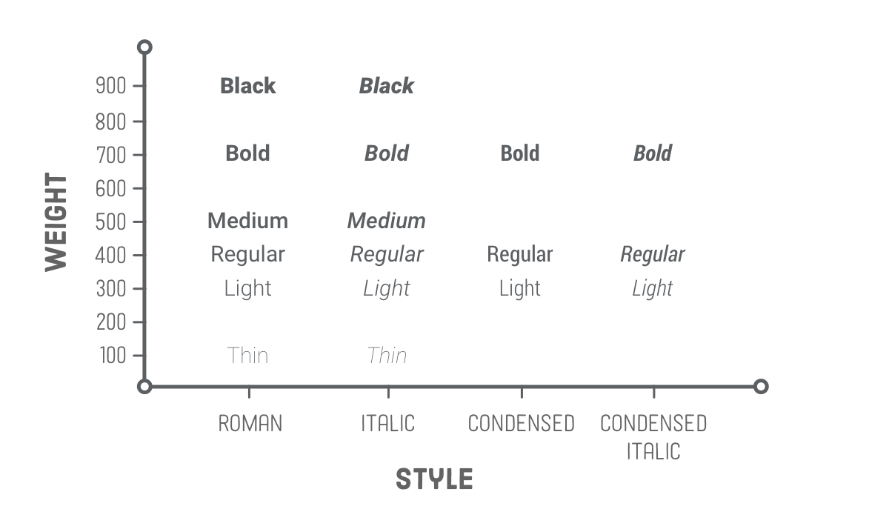

# css

Learn css and make pages pretty


## Table of contents

[TOC]

### Design principle

* 移动优先原则，及默认的css样式为移动样式，然后通过媒体查询 用 桌面样式覆盖
* 整体字体在 14px 到 20px 之间

* 保持适当行距（1.5倍）

* 段落采用缩进或隔行，不能两者同时用，首段不用隔行或缩进


### Font-face




* **定义字体**

  ```css
  @font-face {
      font-family: 'myfont'; /* 自定义名 */
      src: url('myfont.woff') format('woff')  /* 路径，格式 */
  }
  @font-face {
    font-family: 'Roboto';
    src: url('Roboto-Light-webfont.woff') format('woff');
    font-style: normal;
    font-weight: 300;
  }
  
  @font-face {
    font-family: 'Roboto';
    src: url('Roboto-LightItalic-webfont.woff') format('woff');
    font-style: italic;
    font-weight: 300;
  }
  
  @font-face {
    font-family: 'Roboto';
    src: url('Roboto-Bold-webfont.woff') format('woff');
    font-style: normal;
    font-weight: 700;
  }
  ```

* **使用字体**

  ```css
  .line {
      font-family: 'Robot';
  }
  ```


### Responsive img

* **根据不同dpi显示不同图片srcset**

  ```css
  
  ```

* **根据不同像素宽度设置不同图片**

  ```css
  
  ```

* **媒体查询**

  ```css
  <picture>
    <source media='(min-width: 401px)'
            srcset='images/photo-big.jpg'/>
    <source media='(max-width: 400px)'
            srcset='images/photo-tall.jpg'/>
    
  </picture>
  ```


### Css Selector

* **后兄弟节点选择器**(选取h1后**紧邻**的p元素)

  ```css
  h1 + p {
      color: green;
  }
  ```

* **毗邻~**(选取h1后相邻的**所有**p元素)

  ```css
  h1 ~ p {
      color: red;
  }
  ```

* **属性选择器**

  ```css
  /*选择类名已foundicon 开头的元素*/
  [class*="foundicon-"] {
      
  }
  ```

* **起始/结束类型选择器**

  ```css
  /* 选择.container 的第一个p元素 */
  .container p:first-of-type {
      
  }
  /* 选择.container 的最后一个p元素 */
  .container p:last-of-type {
      
  }
  ```

  - [ ] 

### BFC (block formating context)

```css
/* 创建bfc
	float: 值不为none;
	position: 值不为static或relative;
	overflow: 值不为visible;
	display: 值为 table-cell, table-caption, inline-block, flex, inline-flex
*/

/* 最常用方法 */
overflow: hidden;

```

#### BFC的应用

* 解决margin重叠（为每个带有margin的块包裹一个新的bfc）

* 解决浮动元素无法撑开父元素的高度（给包父元素设置为bfc）

* 解决文字环绕浮动元素（给包含文字的元素设置bfc）


### Media Queries

```css
@media only screen and (min-width: 401px) and (max-width: 960px) {
    #main {
        ...
    }
}
```


### FLOAT layout

* **clear: left;** 

  排除 当前元素之前 float: left;元素对此元素的影响， 但之前元素的float: left仍对自身有效；

* 如果一个父元素中有浮动元素，若让子元素**撑开父元素**的高度，方法一：在父元素末尾添加clear: both;的元素。方法二：在父元素增加 overflow: hidden;属性。


### FLEX layout

> [demo1](https://codepen.io/zexiplus/pen/ELppKb) [demo2](https://codepen.io/zexiplus/pen/wjxbEN)

#### 容器属性

* **设置容器为flex布局**

  容器设置为flex后，子元素自动成为容器成员， 子元素的float, clear, vertical-align 都将失效

  ```css
  .box {
      display: flex;
      display: inline-flex;
      display: -webkit-flex; /* Safari */
  }
  ```

* **子元素排列方向**

  当flex-direction 从 row 变为 column 时，justify-content 的意义变为 align-items

  ```css
  flex-direction: row | row-reverse | column | column-reverse;
  ```

* **子元素换行规则**

  nowrap ： 不换行，所有item排列成一排，width ： 100% 被忽略

  ```css
  flex-wrap: nowrap | wrap | wrap-reverse;
  ```

* **水平对齐规则**

  **justify-content**: flex-start | flex-end | center | space-between | space-around;

  ```css
  justify-content: flex-start | flex-end | center | space-between | space-around;
  ```

* **垂直对齐规则**

  **stretch: flex-item** 被纵向拉伸至flex-contanier 一样的高度

  ```css
  align-items: flex-start | flex-end | center | baseline | stretch;
  ```

* **多轴对其规则**

  ```css
  align-content: flex-start | flex-end | center | space-between | space-around | stretch;
  ```


#### 子属性

* **单位宽度 flex**

  ```css
  flex: initial; /* 原始宽度 */
  flex: 1; /* 单位宽度（若其他item没设置，则被拉伸填满）*/
  flex: 2; /* 单位宽度的两倍 */
  ```

* **排列顺序 order**

  ```css
  order: <integer>; 
  ```

* **放大的倍数**

  如果存在剩余空间， 放大的倍数

  ```css
  flex-grow: <number>; /* default 0 */
  ```

* **缩小**

  ```css
  flex-shrink: <number>; /* default 1 */
  ```

* **自身对齐 align-self**

  ```css
  align-self: auto | flex-start | flex-end | center | baseline | stretch;
  ```

* **others**

  把元素撑到右侧

  ```css
  margin-left: auto; /* 会把item撑到右侧 */
  ```

* **主轴空间**

  此属性定义了在分配多余空间之前，项目占据的主轴空间（main size）

  ```css
  flex-basis: <length> | auto; /* default auto */
  ```


### Transition

```css
/* transition */
.trans {
    transition: all 1s ease-out;
}
```


### Css-3D

> [demo-cube](https://codepen.io/zexiplus/pen/NMOVrX)

```css
/* 父元素设置之后，其后代元素便会有3d效果 */
.container {
    trnasform-style: preserve-3d; 
}

.container {
    perspective: 300px;  // 景深  
    perspective-origin: 0px 0px; // 视角起始点
}

.trans {
   transform: translate3d(10px, 10px, 10px) | translateX(30px) | translateY(30px) | 		      translateZ(30px);
   transform: rotateX(90deg) | rotateY(90deg) | rotateZ(90deg);
   transform: scale3d(1, 1, 1) | scaleX(1.2) | scaleY(1.2) |  scaleZ(1.2);
}
```


### Css-filter

* **灰度**

  ```css
  .grayscale {
      filter: grayscale(1) /* 0~1 代表灰度 */
  }
  ```

* **褐色**

  ```css
  .sepia {
      filter: sepia(.5)
  }
  ```

* **饱和度**

  ```css
  .saturate {
      filter: saturate(5)
  }
  ```

* **色相旋转**

  ```css
  .hue-rotate {
      filter: hue-rotate(90deg)
  }
  ```

* **反色**

  ```css
  .invert {
      filter: invert(1)
  }
  ```

* **透明度**

  ```css
  .opacity {
      filter: opacity(.5)
  }
  ```

* **亮度**

  ```css
  .brightness {
      filter: brightness(2)
  }
  ```

* **对比度**

  ```css
  .contrast {
      filter: contrast(.4)
  }
  ```

* **模糊**

  ```css
  .blur {
      filter: blur(10px)
  }
  ```

* **阴影**

  ```css
  .drop-shadow {
      filter: drop-shadow(5px 5px 10px #ccc)
  }
  ```


### Less

* **& 指代自身**

  ```css
  p {
    &:hover {
      ...
    }
  }
  ```

* **定义/使用变量**

  ```css
  @apple: #fff;
  
  span {
      color: @apple;
  }
  ```


### Tips

* **单行超出显示省略号**

  ```css
  .line {
      white-space:nowrap;
      overflow:hidden;
      text-overflow:ellipsis;
  }
  ```

* **多行文本超出显示省略号**

  ```css
  .points {
      display:-webkit-box;
      -webkit-line-cap:3;
      -webkit-box-orient: vertical;
      overflow:hidden;
      text-overflow:ellipsis;
  }
  ```

* **单行文字均匀对齐**

  ```css
  text-align-last: justify;
  ```

* **不定宽元素居中**

  ```css
  .box {
      display: table;
  	margin: 0 auto;
  }
  ```

* **只允许在空格处换行**

  ```css
  .line {
      word-wrap:break-word;
  }
  ```

* **css 实现长宽比例一致div容器**

  **原理**：父容器设置一个bfc（overflow：hidden），让子元素能撑开父元素，站位dummy div设置margen-top为100%，把父元素的高度撑到和其宽一样，.content div用来放真正的内容 

  ```html
  <div class=”container”>
    <div class=”dummy”></div>
    <div class=”content”></div>
  </div>
  ```

  ```css
  .container {
    position:relative;
    overflow: hidden;
    border: 1px solid red;
   }
  
  .dummy {
    margin-top: 100%; /* 指代父容器宽度的 100% 撑开父元素 */
  }
  .content {
    position: absolute;
    top:0;
    left:0;
    right:0;
    bottom:0;
  }
  ```

* **计算属性**

  ```css
  .box {
      width: calc(~"100% - 40px");
  }
  ```

* **滚动条样式**

  ```css
  .scroll-bar {
      1.	::-weskit-scrollbar 滚动条整体部分
      2.	::-webkit-scrollbar-button 滚动条两端的按钮
      3.	::-webkit-scrollbar-track 外层轨道
      4.	::-webkit-scrollbar-track-piece 内层轨道，滚动条中间部分（除去）
      5.	::-webkit-scrollbar-thumb （滚动条里面可以拖动的那个）
      6.	::-webkit-scrollbar-corner 边角
      7.	::-webkit-resizer 定义右下角拖动块的样式
  }
  ```

* **缩放元素**

  ```css
  transform: scale(0.6);
  ```

* **:before , :after 伪类**

  ```css
  .redStar:before {
    content: '*';
    color: red;
  }
  ```

* **倍数行距**

  ```css
  line-height: 1.3;
  ```

* **背景图片大小自适应元素宽度高度**

  ```css
  img {
      background-size: 100% 100%;
  }
  ```

* **控制文字内容用户可选择**

  ```css
  .line {
      user-select: none | text | all | element;
  }
  ```


