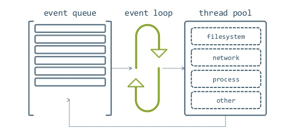

# 实战面试

记录实际前端面试过程中遇到的问题


#### 2018.10.13 （14×13 pass）

- **浏览器小于12px像素字体显示**

  ```css
  span {
      font-size: 12px;
      transform: scale(0.8)
  }
  ```

- **html doctype的意义 (标准模式和兼容模式)**

  标准模式的排版和js以浏览器支持的最高标准运行,  兼容模式浏览器以向后兼容的方式模拟老旧浏览器的行为防止站点无法工作

- **实现ie6, 7 , 8不同字体颜色**

  ```css
  span {
      color: #ccc\9; /*ie 6,7,8 */
      +color: #000; /* ie 6,7 only  */
      _color: #777; /* ie6 only */
  }
  ```

- **Webpack是什么**

  webpack是一个前端模块化方案，更侧重模块打包，我们可以把开发中的所有资源（图片、js文件、css文件等）都看成模块，通过loader（加载器）和plugins（插件）对资源进行处理，打包成符合生产环境部署的前端资源

- **Webpack热刷新原理** 

  使用**webpack-hot-middleware**插件, 使用**SSE**(server sent events)**服务器事件**

  ```js
    // client
    var listener = new EventSource('/message')
    listener.onmessage = function (e) {
        console.log(e.data)
    }
    
    // server
    http.createServer(function (req, res) {
        if (req.url == '/message') {
            res.writeHead(200, {
                'Content-Type': 'text/event-stream',
                'Cache-Control': 'no-cache',
                'Connection': 'keep-alive'
            })
            var i = 0
            setInterval(function() {
                i ++
                res.write('update')
            }, 1000)
        }
    }).listen(3000)
  ```

- **css 实现等边三角形**(原理：利用两个正方形旋转底边)

  ```css
  .box {
      border-bottom: 1px solid #fff;
      width: 100px;
      height: 100px;
      position: relative;
  }
  
  .box:after, box:before {
      position: absolute;
  }
  .box:before {
      transform: rotate(30deg);
      transform-origin: left bottom;
  }
  .box:after {
      transform: rotate(60deg);
      transform-origin: right bottom;
  }
  ```

- **react组件的生命周期**

  - **实例化(渲染期)**
    - getDefaultProps
    - getInitialState (**此时可以访问this.props**)
    - componentWillMount
    - render
    - componentDidMount
  - **存在期**
    - componentWillReceiveProps
    - shouldComponentUpdate (首次渲染不会调用) 
    - componentWillUpdate
    - componentDidUpdate
  - **销毁&清理期**
    - componentWillUnmount

- **什么是受控组件和非受控组件？**


#### 2018.10.17 (dji)


- **防止JS对象被修改**

  - 不可扩展对象Object.preventExtensions(obj) [不能添加新成员]

  - 密封对象 Object.seal(obj) [不能删除, 但属性可修改]

  - 冻结对象 Object.freeze(obj) [不能删不能增不能改]

  - 设置属性 Object.defineProperty, Object.defineProperties

    ```js
    Object.defineProperty(obj, 'name', {
        configurable: boolean, // 是否可删除
        enumerable: boolean, // 是否可枚举
        writable: boolean, // 是否可修改
        value: val // 属性值
    })
    ```


- **CSS选择符有哪些？哪些属性可以继承？**

  可继承 **字体, 颜色, 字大小, 缩进**


- **前端存储方式有哪些？**

  **Cookie, localStorage, sessionStorage, indexDB**

- **什么是面向对象？面向对象有哪些基本特征？**

- 面向对象是一种思想. 面向对象是指, 把复杂过程封装在对象中,细节交给对象实现, 只暴露出简单的接口,让对象去实现具体的细节.  这种思想将数据作为第一位, 方法其次, 这是对数据的优化, 简化了过程.  通过继承机制, 实现对象之间的属性,方法共用.

- **封装性**: 隐藏具体细节, 隔离变化, 仅提供外部访问的接口

- **继承性:** 子类继承父类的一些方法, 可以提高代码复用性

- **多态性: **同一方法可以在子类和父类有不同实现

- **千位符**

  ```js
  function format(num){
      if(!num) return
      var numString = num.toString()
      var trailIndex = numString.indexOf('.')
      var headString
      if (trailIndex >= 0) {
          var trail = numString.slice(trailIndex)
          headString = numString.slice(0, trailIndex)
          return numString.replace(/(\d{3}\B)/g, function($1) {
              return $1 + ','
          }).concat(trail)
      } else {
  		headString = numString
          return numString.replace(/(\d{3}\B)/g, function($1) {
              return $1 + ','
          })
      }
  }
  
  console.log(format(1231423423.22)) //1,231,423,423.22
  ```

- **快排算法**

  ```js
  var quicksort = function (arr) {
      // 递归函数, 终止情况为数组的长度为1
      if (arr.length <= 1) {
          return arr;
      }
      var pivotIndex = Math.floor(arr.length / 2); // 选取一半位置为基准点
      var pivot = arr.splice(pivotIndex, 1)[0]; // 挑选出基准值
      var left = [];
      var right = [];
      // 建立左右两个数组, 左边存放小于基准的数值, 右边存放大于基准的数值
      for (var i = 0; i < arr.length; i++) {
          if (arr[i] < pivot) {
              left.push(arr[i]);
          } else {
              right.push(arr[i]);
          }
      }
      // 调用自身并进行连接 返回排序后的数组
      return quicksort(left).concat([pivot], quicksort(right));
  };
  var array = [8, 7, 0, 7, 5, 2, 5, 3, 1];
  quicksort(array); // [0,1,2,3,5,5,7,7,8] 
  ```

- **链表与数组的区别**

  - 数组是在内存中连续存放的
  - 插入存储效率低
  - 查找效率高
  - 不利于扩展, 数组定义的空间不够要重新定义数组
  - 链表在内存中存放不是连续的
  - 每一个数据都保存着下一个数据的地址
  - 插入增加数据效率高
  - 查找数据效率低
  - 不指定大小, 扩容方便

- **性能优化**

  - 合并文件 , 使用 css精灵图以 减少http请求
  - 使用合适的缓存策略 响应头增加 expire, max-age字段 增加E-tag
  - 选择适当的图片格式, 压缩图片质量
  - 使用cdn
  - 选择合理的 web component更新方式和周期
  - 压缩组件, js,css
  - 减少重定向
  - 不要使用css表达式
  - 减少dns查询次数
  - 合理使用预加载和懒加载

- **进程间通信(ipc)方式有哪些**

  - 匿名管道(**pipe**) 半双工, 数据单向流动, 只能在亲缘(父子)进程间使用
  - 具名管道(**named pipe**) 允许非亲缘管道间使用
  - 高级管道(**popen**)  将另一个进程在当前程序中启动
  - 消息队列(**message queue**) 消息队列是存放消息的链表, 克服了管道只能传递无格式字节流, 和缓冲区大小受限的情况
  - 信号(**sinal**)
  - 共享内存通信(**shared memory**) 由一个进程创建, 多个进程共享的内存, 是最快的进程间通讯方式
  - 套接字(**socket**)  可用于不同主机之间通讯 步骤 命名, 绑定, 监听, 连接, 发送信息, 解绑


#### 10.18 （12 × 14 pass）

- **简单与复杂请求**

  - **简单请求**: 两者必须都满足

    - 仅包含GET, HEAD or POST(如果是post, content-type必须是 application/x-www-form-urlencoded, multipart/form-data, or text/plain 其中一种)
    - 没设置自定义头信息的请求 

  - **复杂请求**

    不满足简单请求的请求类型

    1. 获取服务器支持的HTTP请求方法；也是黑客经常使用的方法。
    2. 用来检查服务器的性能。例如：AJAX进行跨域请求时的预检，需要向另外一个域名的资源发送一个HTTP OPTIONS请求头，用以判断实际发送的请求是否安全。

- **http2**

  - **首部压缩**
    - 如果首部发生变化了，那么只需要发送变化了数据在Headers帧里面，新增或修改的首部帧会被追加到“首部表”
  - **共享同一个tcp连接**
    - “资源合并减少请求”的优化手段对于HTTP2.0来说是没有效果的，只会增大无用的工作量而已
    - http1一个域名限制打开6个tcp连接， 所以使用cdn1， cdn2 ， cdn3 ...分发不同资源， http2不需要
  - **并行双向字节流的请求和回应**
    - 同一链接上有多个不同方向的数据流在传输。客户端可以一边乱序发送stream，也可以一边接收者服务器的响应，而服务器那端同理
  - **请求分有优先级**
    - 每个HTTP2.0流里面有个优先值，这个优先值确定着客户端和服务器处理不同的流采取不同的优先级策略，高优先级的流都应该优先发送，但又不会绝对的
  - **服务端推送**
    - 除了对最初请求的响应外，服务器还可以额外向客户端推送资源，而无需客户端明确地请求
    - 下次请求时直接从缓存中读取

- **diff算法**

- **xss, csrf防范**

- **cookie设置**

#### 10.19 （taobao fail）


- **讲讲对mvvm模式的理解**

  **model（模型层）， view（视图层）， viewmodel（展示模型)**

  展示模型将模型层中的**数据与复杂的业务逻辑封装成属性与简单的数据**暴露给视图，让视图和展示模型中的属性进行同步, 同时用户改变视图, 视图通过视图模型, 修改数据同步至模型上.

- **讲讲 vue store**

- **讲讲至今遇到的最大困难**

  what，how，why,  done，right，better

- **说一下Event loop**

  **Event Loop是一个程序结构，用于等待和发送消息和事件.**

  简单说，就是在程序中设置两个线程：一个负责程序本身的运行，称为"主线程"；另一个负责主线程与其他进程（主要是各种I/O操作）的通信，被称为"Event Loop线程"（可以译为"消息线程"）

  Node采用的是单线程的处理机制(所有的I/O请求都采用非阻塞的工作方式)，至少从Node.js开发者的角度是这样的。而在底层，Node.js借助libuv来作为抽象封装层，从而屏蔽不同操作系统的差异，Node可以借助livuv来实现线程。

  Libuv库负责将不同的任务分配给不同的线程，形成一个事件循环，以异步的方式将任务的执行结果返回给V8引擎。

  每一个I/O都需要一个回调函数——一旦执行完便堆到事件循环上用于执行

  

  

- **vue-router 的 跳转实现原理**

  我们都知道，单页面应用(SPA)的核心之一是: **更新视图而不重新请求页面**;vue-rouetr在实现单页面前端路由时，提供了两种方式：**Hash模式和History模式；根据mode参数来决定采用哪一种方式**。

  那为什么这两种方式能够实现试图更新不跳转，其原因在于：

  - **Hash模式**： 
    ​ hash（#）是URL 的锚点，代表的是网页中的一个位置，单单改变#后的部分，浏览器只会滚动到相应位置，不会重新加载网页，使用”后退”按钮，就可以回到上一个位置；

    1 $router.push() //显式调用方法

    2 HashHistory.push() //（window.location.hash= XXX）

    3 History.transitionTo() //开始更新

    4 History.updateRoute()  //更新路由

    5 {app._route= route} 

    6 vm.render() //更新视图

    7监听hash变化(**window.onhashchange**)

  - **History模式：** 
    ​    HTML5 History API提供了一种功能，能让开发人员在不刷新整个页面的情况下修改站点的URL，就是利用 **history.pushState** API 来完成 URL 跳转而无须重新加载页面；

    - **history.replaceState**

      仅仅替换浏览器的地址栏, 并不发出请求, 退后按钮无作用

      `history.replaceState(null, null, 'hello');`

    - **history.pushState**

      ```javascript
      history.pushState([data], [title], [url]);
      ```

       点击浏览器的后退按钮，你会发现它和你预想的效果一样。因为pushState方法将我们传给它的URL添加到浏览器的history中，从而改变了浏览器的history,在HTML5History的构造函数中监听popState（**window.onpopstate**）


#### 10.20

- **最近在研究哪些技术,仓库?**
  - rx.js
  - tars.js
  - nuxt.js
  - serviceWorker

#### 10.30

- **自我介绍**

  https://www.zhihu.com/question/21387153/answer/264462043

  - 我最突出的技能是什么
  - 我在哪方面的知识掌握是最全面的
  - 我性格上最大的优势是什么
  - 我最擅长的事情是什么
  - 我有哪些成就和贡献

​	我是施泽西,河南郑州人, 今年24岁, 毕业于中南林业科技大学2017届本科, 至今有一年半的工作经验. 毕业后在深圳市茁壮网络股份有限公司就职, 担任web前端开发工程师一职, .

​	我负责的工作主要是pc端页面的构建, 维护和开发. 当然也曾开发过一些手机端和电视端的页面. 在我就职期间我参与开发过**pc端运营数据大数据可视化系统**, **党员建设管理系统**, **独立负责智慧教育后台管系统**, 路由器设置系统. 还有公司内部homed后台管理系统的维护.除了公司的业务, 自己也喜欢做一些比较有趣的开源项目, 

​	2.因为所在公司技术选型的原因, 我最**擅长**的技术栈是 vue + elementUi + webpack, 除此之外也钻研和使用react作为主要使用和学习的技术框架.**我认为自己有一定js语言基础, 注重实践, 善于实现复杂的业务逻辑和用户交互**可与优化应用性能,  我专注于研究javascript的运行机制, css 的复杂表现, html的语意化.

​	3.再说说我的性格, 我认为自己是一个积极进取的人, 对自身自律. 喜欢在一定的时间内钻研一件事情. 对互联网技术有着浓厚的兴趣. 我还有一个特质就是不服输, 不怕失败. 我喜欢在失败中分析失败的原因, 避免下次失败. 我在工作生活中也是这样, 如果一件事情让我犹豫不决, 我会去尝试, 哪怕失败. 再来一遍很多情况下就会有好的结果.

​	4.我最擅长做有挑战性的事情, 无论是时间上还是技术上的挑战. 我善于在闲暇之余分析项目, 找出此项目存在的问题, 还有哪些需要改善, 哪些比较浪费时间和精力去管理, 然后去做优化. 我乐于用自己所学的知识运用在实际的项目上, 

​	5.最后说说我的贡献, 我能高效准时的完成开发任务, 在极端情况下无法按时完成任务, 也会去和leader沟通, 实时汇报工作进度.也乐于帮助同事去分析一些bug.这些是我在工作中的主要贡献. 


- **闭包的使用场景**

  - 缓存数据, 事件处理函数缓存数据

    ```js
    button.onclick = (function(num) { return function () {console.log(num ++})(1)
    ```

  - 面向对象编程对象的私有方法创建


- **http 和 https的区别是什么, 用到了哪些算法, 是怎样实现的?**

  https在http上增加了ssl/tls层协议， 使得信息传输不再是明文， 更安全。

  ssl层加密技术分为对称加密，和非对称加密， 常用的非对称加密有RSA算法， RSA算法采用分解大质数原理

  服务器会提供公钥和证书给客户端， 公钥用于客户端加密， 证书解决了公钥防伪造认证问题。

  此外， http默认端口 80， https默认端口 443

- **用js实现一个散列类**


- **margin: 5px 20px 30px; 上下左右的margin分别是多少?** 

  上5px， 左右20px， 下30px


* **js的简单类型和复杂类型存储在哪些地方， 有什么区别？**

  复杂类型存放在堆区， 存放比较快， 但查找较慢， 变量赋值复制的是内存地址（索引）

  简单类型存储在栈区， 存放慢， 查找快， 变量赋值复制的是值为非索引

#### 11.11 (jin ri tou tiao fail)

- **为什么使用hightChart.js , 它使用的svg对比canvas有什么优势**

  [参考](https://www.zhihu.com/question/19690014)

  * hightChart.js采用svg， svg 是基于xml的， 部分采用 canvas保证了良好的兼容性， 可在不支持svg的浏览器上使用canvas保证向下兼容
  * 因为svg基于xml， 操作xml也是操作dom， 一些事件绑定可以实现， 也可以自定义操作dom


- **vue是怎么实现v-model双向数据绑定的, diff算法的实现原理**

- **http://toutiao.com 往 http://mp.toutiao.com发送一个ajax请求，请问跨域了么？mp.toutiao.com 的服务器可以收到是怎样的请求？解决跨域的方法**

  * 跨域了, 跨域的要求是: **协议, 端口, 域名**中有一项不同都属于跨域, **子域名和父域名也属于域名不同**（localhost和127.0.0.1也是跨域）

  * 服务器会收到跨域的ajax请求(cors), **如果是简单请求会直接收到请求, 如果是复杂请求, 浏览器会先发送请求预检(options)**. 服务器会对比请求头的origin字段与响应头设置的access-control-allow-origin对比, 如果通过检验, 则发送cors响应

  * 解决办法, 服务端的响应头增加access-control-allow-origin 包含请求的域

- **Promise的 all方法和race方法**

  - **Promise.all**

    - Promise.all, 接受一个数组作为参数, 其中p1, p2, p3 都是promise实例, 如果不是, 会分别调用Pmoise.resolve 方法转化为promise, p的状态受p1, p2, p3决定

    - **若p1, p2, p3都变为fulfilled时, p才变为fulfilled**, 此时p1, p2, p3返回值组成一个数组, 传递给p的callback

    - 若p1, p2, p3**其中一个变为rejected状态, p就转变为rejected**, 此时第一个被reject实例的返回值, 会被传递给p的callback

      ```js
      const p = Promise.all([p1, p2, p3])
      ```

  - **Promise.race**

    - `Promise.race`方法的参数与`Promise.all`方法一样，如果不是 Promise 实例，就会先调`Promise.resolve`方法，将参数转为 Promise 实例，再进一步处理.

    - **只要`p1`、`p2`、`p3`之中有一个实例率先改变状态，`p`的状态就跟着改变**。那个率先改变的 Promise 实例的返回值，就传递给`p`的回调函数

      ```js
      const p = Promise.race([p1, p2, p3])
      ```

- **HTTP缓存介绍？**

  * **强缓存**

  * **协商缓存**

- **实现一个长宽比为4：3的div**

  * 使用子元素margin撑开父元 , **margin是以父元素的宽度计算的**

    ```css
    .container {
        width: 200px;
    }
    .container:after {
        content: '';
        margin-top: 75%;
    }
    ```

  * 利用自身padding, **padding是用自身宽度计算的**

    ```css
    .container {
        width: 200px;
        padding-bottom: 75%;
    }
    ```


- **算法求：数组A，取M个数，和为N**

  例如: A 2000个数的数组 , M 50, N 1000

- **最近关注的新技术**

  * 服务端： egg.js, ssr(nuxt.js)
  * 移动端： weex， 小程序， react-native, PWA(渐进式web应用于离线应用)， android快应用
  * 其他 electron， rx.js， PWA（渐进式web应用）， 服务端渲染


#### 12.21 (shenxinfu pass)

* **http 请求类型**

  * get, post, head, delete, put

  * options 试探访问， 测试服务器能力

  * trace 回显服务器收到的请求， 用于测试或诊断

  * connect 将连接改为管道式的方式， connect的作用就是将服务器作为代理，让服务器代替用户去访问其他网页(vpn)

* **promise 的优缺点**

  * 优点： 避免嵌套回调函数的书写方式

  * 缺点：

    * 内部错误必须用promise.prototype.catch才能捕获， 不能暴露给外部
    * promise一旦执行， 无法取消
    * pending状态无法知道具体的执行细节和状态

* **实现快速排序算法**

  * 思路： 

    * 定义一个递归调用的函数quickSort， 递归调用自身， 当入参的数组长度只有一项时返回数组

      ```js
      if (arr.length <= 1) {
          return arr
      }
      ```

    * 函数内部定义基准点和基准数

      ```js
      let pivotIndex = Math.floor(arr.length / 2)
      let pivot = arr[pivotIndex]
      ```

    * 循环遍历数组， 把小于基准数的数组推到数组left， 大于基准数的推到数组right

      ```js
      let left, right;
      arr.forEach(item => {
          if (item < pivot) {
              left.push(item)
          } else {
              right.push(item)
          }
      })
      ```

    * 把数组left和 数组right作为参数调用并连接函数的返回结果 

      ```js
      return quickSort(left).concat(quickSort(right))
      ```

* **es6新的数据结构**

  * symbol 用于 定义一个独一无二的值， 作用： 用作object的键值

* **let var的区别** 

  * var 在作用域内变量会提升， let不会
  * var允许在作用域内重复声明， let不允许
  * 作用域

* **常见web安全防护类型， 举例**

  * csrf  例如：诱链点击
  * xss  例如：用户表单提交包含恶意代码的字段

* **设计模式有哪些**

  * 工厂， 单例， 发布订阅模式
  * 构造函数模式， 模块模式

* **正则匹配手机号， html标签内容， 捕获组和非捕获组**

  * 知识点： 

    * `\w === [a-zA-Z0-9]` 匹配所有字母

    * `\1`反向引用第一组

    * **捕获组**：当一个模式的全部或部分内容由一对括号时， 它就对内容进行捕获并临时存储于内存中， 可以通过后向引用重用捕获的内容

      `/1234(abc|def)\1/`

    * **非捕获组**（Non- Capturing Group）： Group）。 非 捕获 分组 不会 将其 内容 存储 在 内存 中。 在 你 并不 想 引用 分组 的 时候， 可以 使用 它。 由于 不 存储 内容， 非 捕获 分组 就会 带来 较高 的 性能， 而 运行 本书 的 简单 示例 很难 察觉到 性能 的 提升。

      `/1234(?: abc|def)/`

* **讲讲event loop, mirco task 和 task(macro task)**

  * **event loop** : JS 执行是单线程的，它是基于事件循环的。事件循环大致分为以下4个步骤：

    * 所有同步任务都在主线程上执⾏，形成⼀个执⾏栈（execution context stack）。
    * 主线程之外，还存在一个"任务队列"（task queue）。只要异步任务有了运行结果，就在"任务队
      列"之中放置一个事件。
    * 一旦"执行栈"中的所有同步任务执行完毕，系统就会读取"任务队列"，看看里面有哪些事件。那
      些对应的异步任务，于是结束等待状态，进入执行栈，开始执行
    * 主线程不断重复上述第三步

    ```js
    for (macroTask of macroTaskQueue) {
    // 1. Handle current MACRO-TASK
    	handleMacroTask();
    // 2. Handle all MICRO-TASK
    	for (microTask of microTaskQueue) {
        	handleMicroTask(microTask);
        }
    }
    ```

  * **task**

    在浏览器环境中，常见的 **macro task** 有 `setTimeout`、`MessageChannel`、`postMessage`、`setImmediate`。而常见的 **micro task** 有 `MutationObsever` 和 `Promise.then`

* **vue的异步更新队列怎么实现的**

  [参考链接1](https://blog.csdn.net/u010014658/article/details/72510305)

  [参考链接2](https://segmentfault.com/q/1010000005813183)

  * nextTick 内部使用promise.then或mutationObserver或setTimeout来实现

  * nextTick被使用的地方

    * 用户使用

    * vue内部处理dom更新时使用(在同一时间循环中只触发一次跟新)

      ```js
      function queueWatcher (watcher) {
          var id = watcher.id;
          if (has[id] == null) { // 记录触发更新的 watcher id
              has[id] = true;
              if (!flushing) {
                  queue.push(watcher);
              } else {
                  var i = queue.length - 1;
                  while (i >= 0 && queue[i].id > watcher.id) {
                      i--;
                  }
                  queue.splice(Math.max(i, index) + 1, 0, watcher);
              }
              if (!waiting) {
                  waiting = true;
                  nextTick(flushSchedulerQueue);
              }
          }
      }
      ```

* **vue的diff 算法实现原理**

* **vue的自定义指令, 应用场景**

  自定义指令的生命周期函数

  * `bind`：只调用一次，指令第一次绑定到元素时调用。在这里可以进行一次性的初始化设置。
  * `inserted`：被绑定元素插入父节点时调用 (仅保证父节点存在，但不一定已被插入文档中)。
  * `update`：所在组件的 VNode 更新时调用，**但是可能发生在其子 VNode 更新之前**。指令的值可能发生了改变，也可能没有。但是你可以通过比较更新前后的值来忽略不必要的模板更新 (详细的钩子函数参数见下)。
  * `componentUpdated`：指令所在组件的 VNode **及其子 VNode** 全部更新后调用。
  * `unbind`：只调用一次，指令与元素解绑时调用。

  ```js
  // 定义
  directives: {
      focus: {
          bind() {},
          inserted: function(el, binding, vnode, oldVnode) {
          	el.focus()
              /* 
              	binding.name --> focus
              	binding.value --> true
              */
          },
         	update: function() {},
          componentUpdated() {},
          unbind() {},
      }
  }
  ```

  ```html
  <!-- 使用 -->
  <input v-focus="true" />
  ```

* **html5的新特性**

  * mutationobserver 监控dom改变
  * 语意特性,添加`<header><header/><nav><nav>`等标签
  * 多媒体， 用于媒介回放的 video 和 audio 元素
  * 图像效果，用于绘画的 canvas 元素，svg元素等
  * 离线 & 存储,对本地离线存储的更好的支持,local Store,Cookies等
  * 设备兼容特性 ，HTML5提供了前所未有的数据与应用接入开放接口。使外部应用可以直接与浏览器内部的数据直接相连，
  * 连接特性，更有效的连接工作效率，使得基于页面的实时聊天，更快速的网页游戏体验，更优化的在线交流得到了实现。HTML5拥有更有效的服务器推送技术，Server-Sent Event和WebSockets就是其中的两个特性，这两个特性能够帮助我们实现服务器将数据“推送”到客户端的功能
  * 性能与集成特性，HTML5会通过XMLHttpRequest2等技术，帮助您的Web应用和网站在多样化的环境中更快速的工作
  * 离线应用PWA


* **css 选择器有哪些  权重分别是**

  * 伪类和类权重相同
  * !important > inline-style > id